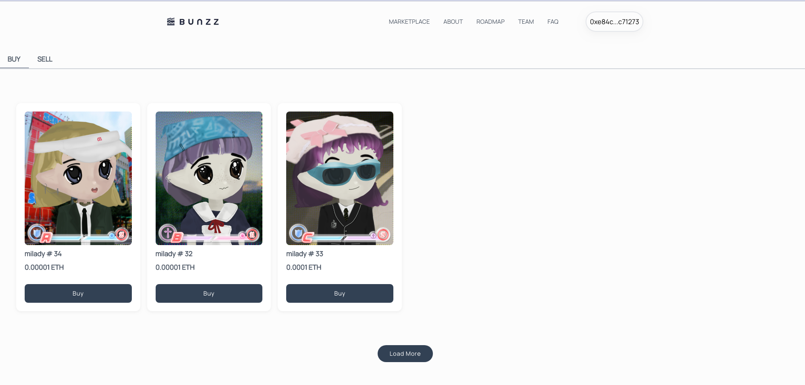
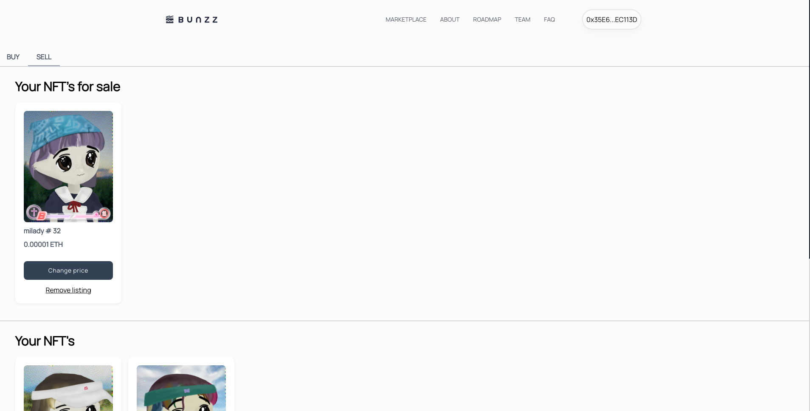
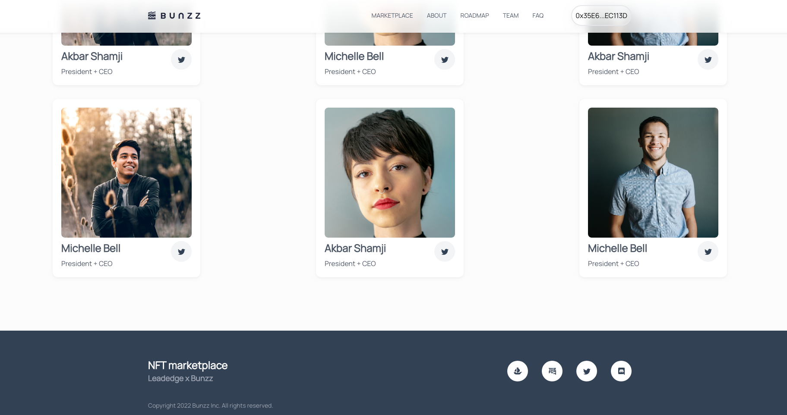
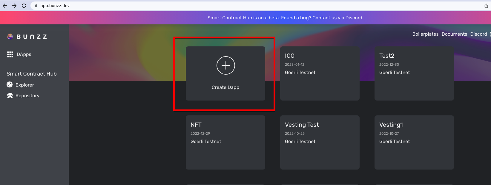
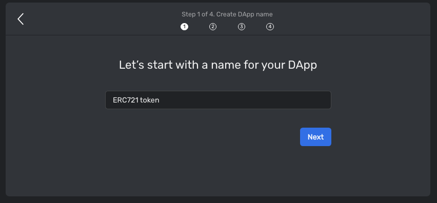
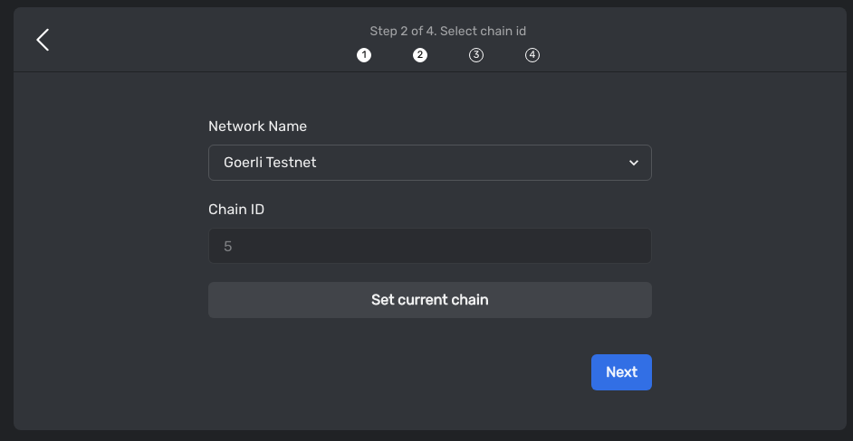
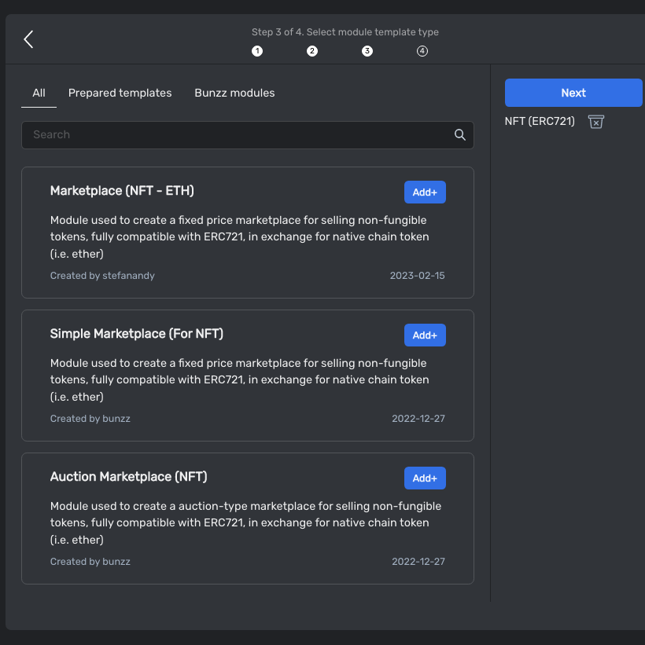
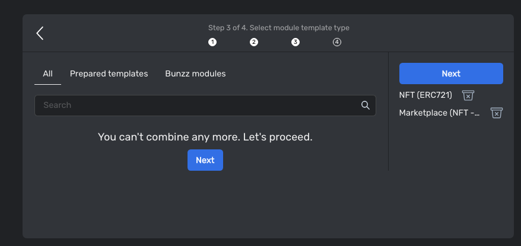
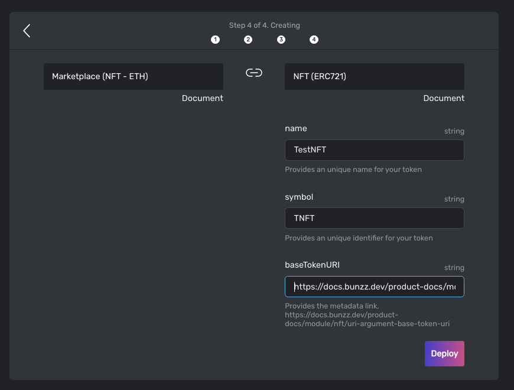
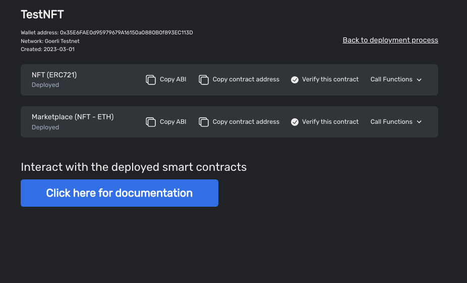

# Boilerplate for NFT marketplace

This boilerplate is for NFT marketplace.
Using this boilerplate, you can create NFT marketplace website.







# How to create this application?

## Deploy smart contracts

### [Deploy ERC721 token contract](https://app.bunzz.dev/module-templates/a50a356b-84b4-4ca1-aa21-432a73d11e1f)

Please deploy ERC721 token contract

- Click `Create Dapp` box



- Input DApp name



- Select the chain you want to deploy the contracts on.



- Search and select one of ERC721 token modules

If you have already an ERC721 token, you can skip this.



- Search and select [Marketplace(NFT-ETH)](https://app.bunzz.dev/module-templates/9011d43b-d345-4f66-8729-be5b660a86b5)



- Input token name, symbol and baseTokenURI. (If you didn't select ERC721 module, you don't need to add the token name and symbol).



- Clicking `Deploy` button, you can deploy the smart contracts using metamask wallet.



## Create NFT marketplace

### Clone NFT marketplace boilerplate repository.

Clone [this repository](https://github.com/lastrust/nft-marketplace-boilerplate)

```
git clone https://github.com/lastrust/nft-marketplace-boilerplate
```

### Install app

```
cd nft-marketplace-boilerplate

yarn install
```

### Add contract addresses

Please update `src/lib/web3_constants.ts` file with the smart contract addresses you deployed.

```
import { BigNumber } from 'ethers';

export const Decimals = BigNumber.from(18);
export const OneToken = BigNumber.from(10).pow(Decimals);

export const ERC721TOKEN_ADDRESS = '';
export const MARKETPLACE_ADDRESS = '';

export const CHAIN_ID = ; // numeric

export const CHAIN_INFO = {
  chainId: '', // hex
  rpcUrls: [''],
  chainName: '',
  nativeCurrency: {
    name: 'ETH',
    symbol: 'ETH',
    decimals: 18,
  },
  blockExplorerUrls: ['https://goerli.etherscan.io'],
};

```

### Run application

Development mode

```
yarn dev
```

Production mode

```
yarn build
yarn start
```


Now you can use this application.

To learn more, please ask in [our discord](https://discord.gg/wCFUV6rNd7)